# ISO Installation Guide

This guide walks you through installing HyprFlux using the ISO image. This method installs a complete Arch Linux operating system with HyprFlux pre-configured.

## Prerequisites

Before you begin, ensure you have:

- A USB drive (8GB or larger)
- A computer with x86_64 architecture
- At least 4GB of RAM (8GB+ recommended)
- At least 30GB of free disk space
- An active internet connection (required during installation)

## Download Links

| Source              | Link                                                                                                        | Notes                    |
| ------------------- | ----------------------------------------------------------------------------------------------------------- | ------------------------ |
| **GitHub Releases** | [Download v1.0.0](https://github.com/ahmad9059/HyprFlux-ISO/releases/tag/1.0.0)                             | Primary release channel  |
| **Google Drive**    | [Download from Drive](https://drive.google.com/drive/folders/1ptOUoY4H7l4jT0jFcKoX9yxOKdc43m-_?usp=sharing) | Mirror for faster access |
| **SourceForge**     | [Download from SourceForge](https://sourceforge.net/projects/hyprflux/files/v1.0.0/)                        | Alternative mirror       |

## Create a Bootable USB

Using `dd`:

```bash
sudo dd if=hyprflux-*.iso of=/dev/sdX bs=4M status=progress oflag=sync
```

Replace `/dev/sdX` with your USB device (e.g., `/dev/sdb`).

Using `balenaEtcher`:

1. Download and install [balenaEtcher](https://www.balena.io/etcher/)
2. Select the ISO file
3. Select your USB drive
4. Click "Flash"

## Boot from USB

1. Insert the bootable USB drive into your computer
2. Restart your computer
3. Enter the boot menu (usually F12, F10, F2, or Escape during startup)
4. Select the USB drive from the boot menu
5. Choose "HyprFlux" from the boot menu

::: tip UEFI vs BIOS
The ISO supports both UEFI and Legacy BIOS boot modes. Select the appropriate option for your system.
:::

## Installation Process

The HyprFlux installer will launch automatically after booting. It uses a TUI (Text User Interface) with the following steps:

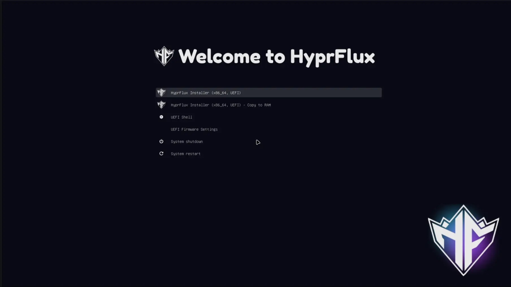


### Step 0: Network Setup

The installer will automatically detect and configure your network connection using NetworkManager. If you need to connect to Wi-Fi, you can use `nmtui` before starting the installation.

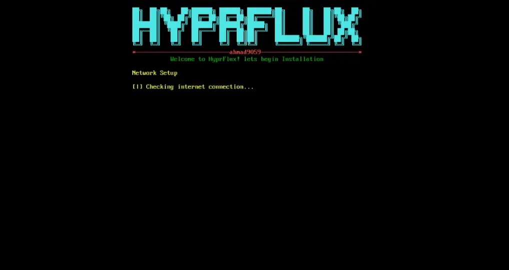

### Step 1: Welcome

The installer displays a welcome message with the HyprFlux logo and installation overview.

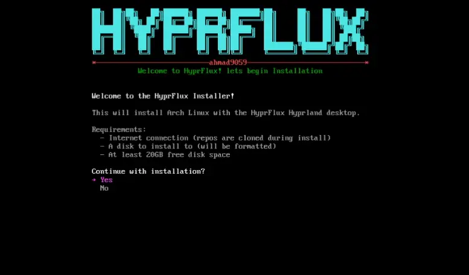

### Step 2: Timezone Selection

Select your timezone from the list or search for your location.

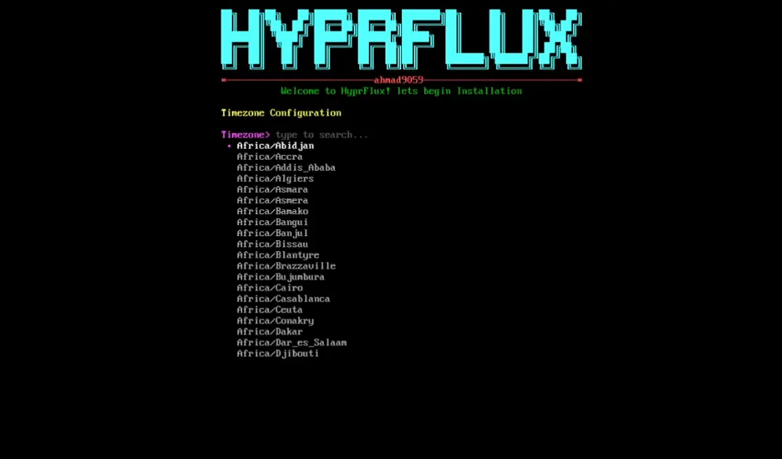

### Step 3: Locale Selection

Choose your system locale (language and character encoding).

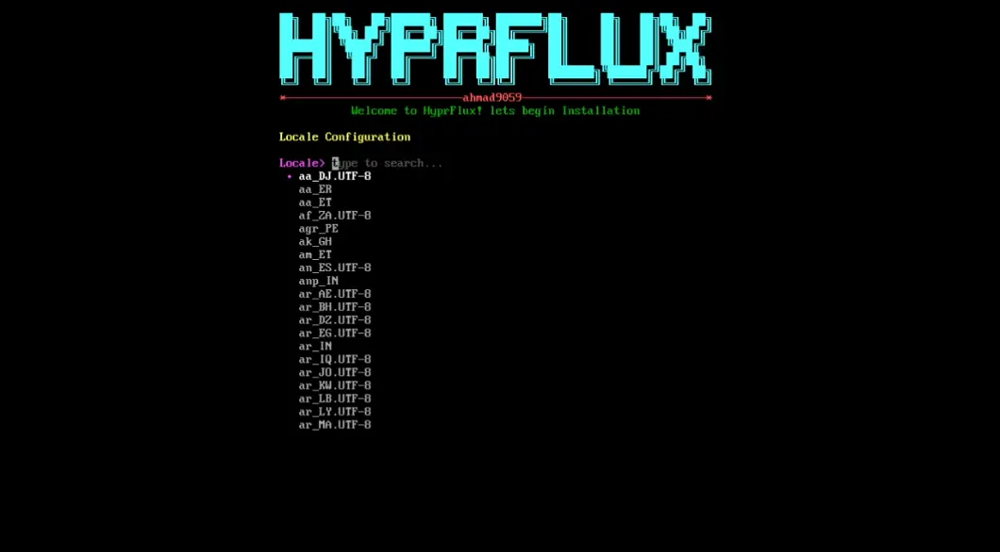

### Step 4: Keyboard Layout

Select your keyboard layout from the available options.

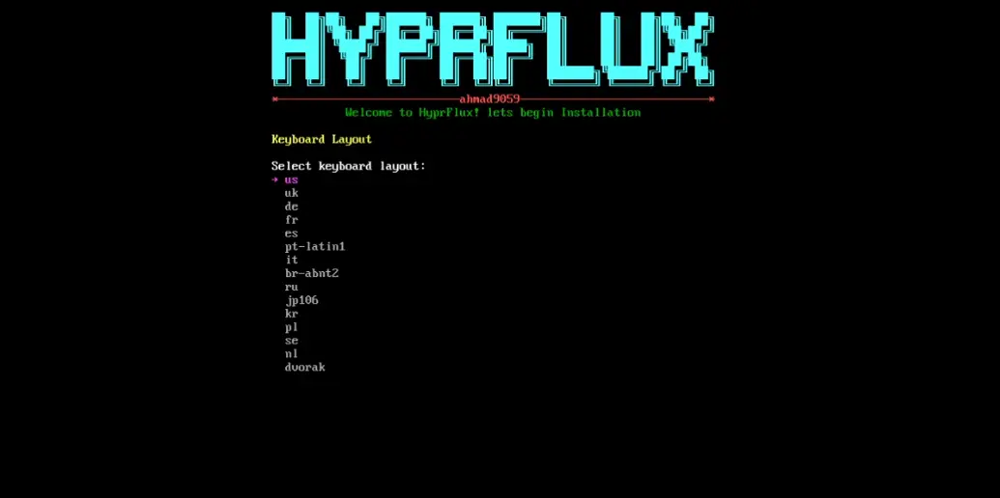

### Step 5: Hostname

Enter a hostname for your computer (e.g., `hyprflux-pc`).

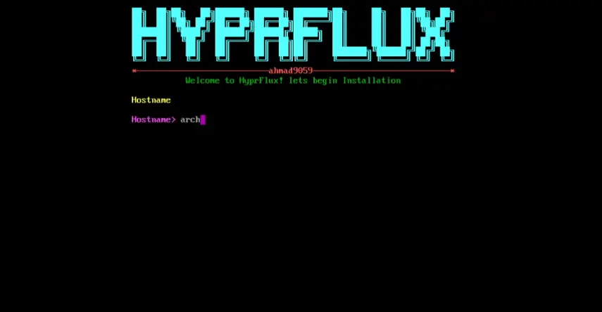

### Step 6: User Creation

Create a user account:

- Enter your full name
- Enter a username
- Set a password
- Confirm the password

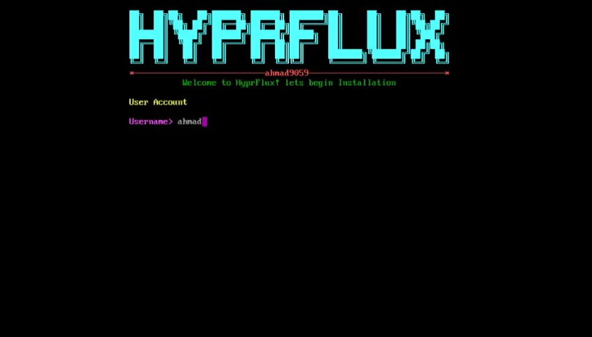

::: warning Important
Remember your password! You'll need it to log in after installation.
:::

### Step 7: Disk Partitioning

Choose your partitioning method:

**Automatic (Recommended for beginners):**

- Wipes the entire selected disk
- Creates EFI, swap, and root partitions automatically
- Best for clean installations

**Manual (Advanced):**

- Allows custom partitioning
- You must create and format partitions yourself
- Best for dual-boot or custom setups

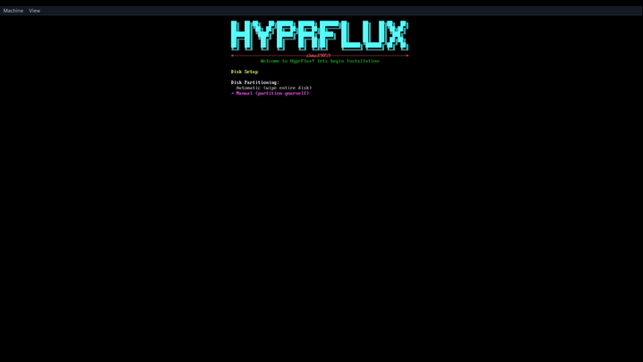

::: danger Data Loss Warning
Automatic partitioning will erase all data on the selected disk. Make sure to backup important data before proceeding!
:::

### Step 8: Base System Installation

The installer will:

- Format the partitions
- Install the base Arch Linux system using `pacstrap`
- Install essential packages

This step requires an active internet connection and may take 10-20 minutes depending on your connection speed.

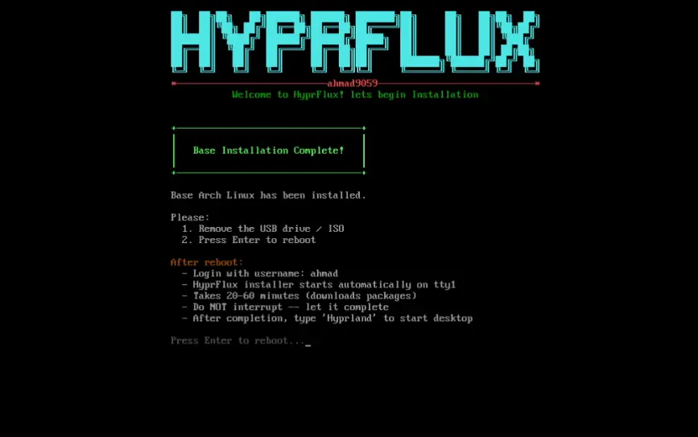

After the base Arch Linux installation is complete, it will ask for reboot. Press Enter to reboot the system.

### Step 9: System Reboot

After the system reboots, it will ask you to enter the username and password you created earlier.

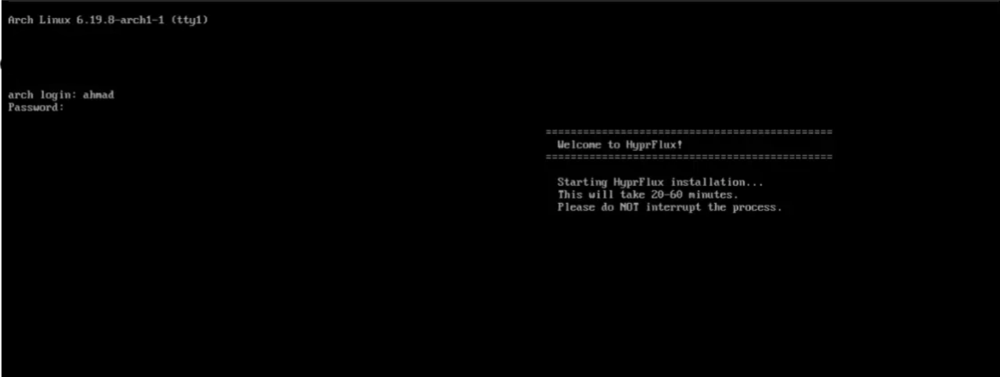

### Step 10: HyprFlux Integration

The HyprFlux installer starts the installation of HyprFlux. It may ask for your password again.

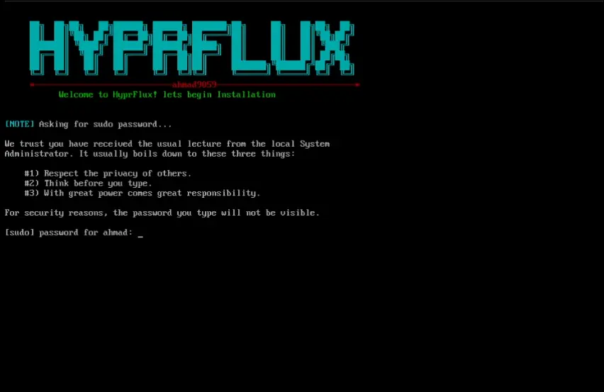

This step requires an active internet connection and may take 10-20 minutes depending on your connection speed to set everything up. **It may ask for your sudo password 2-3 times, so enter it when needed.**

### Step 11: Optional Packages Installation

The installer will ask to install optional packages from Pacman and Yay. Install them according to your preference.

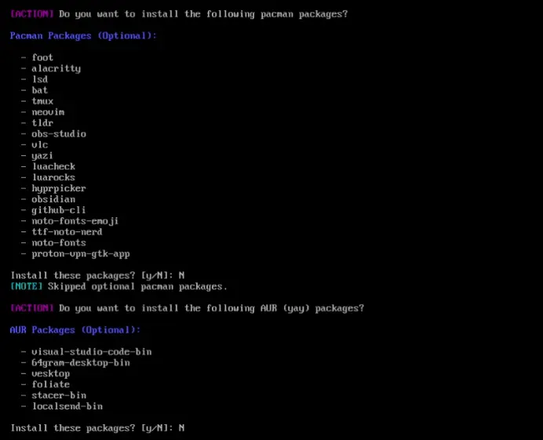

### Step 12: Installation Complete

**Congratulations! HyprFlux installation is complete.**

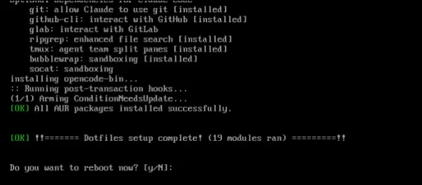

::: tip Welcome to HyprFlux!
You're all set! Enjoy your new HyprFlux desktop environment. Don't forget to star the repository if you like it!
:::

## First Boot

After rebooting:

1. **Bootloader:** Select HyprFlux from the GRUB menu
2. **Login:** Enter your username and password at the SDDM login screen
3. **First-Boot Setup:** The system will automatically complete initial setup:
   - Configure GTK themes
   - Set up PipeWire audio
   - Apply final configurations
4. **Desktop:** You'll be logged into the HyprFlux desktop

## Post-Installation

### Initial Setup

1. **Update the system:**
   ```bash
   sudo pacman -Syu
   ```

2. **Customize your desktop:**
   - Edit configs in `~/.config/`
   - Change wallpapers in `~/Pictures/wallpapers/`
   - Modify keybindings in `~/.config/hypr/`

### Useful Locations

- **Configs:** `~/.config/`
- **Wallpapers:** `~/Pictures/wallpapers/`
- **Themes:** `~/.themes/`
- **Icons:** `~/.icons/`

### Getting Help

- Check the [Keybindings](/keybindings/hyprland) reference
- Report issues on [GitHub](https://github.com/ahmad9059/HyprFlux/issues)