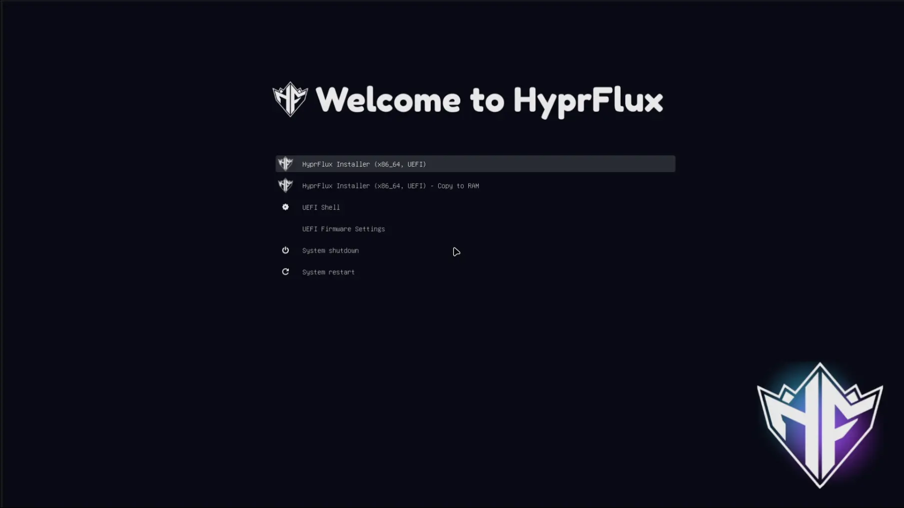
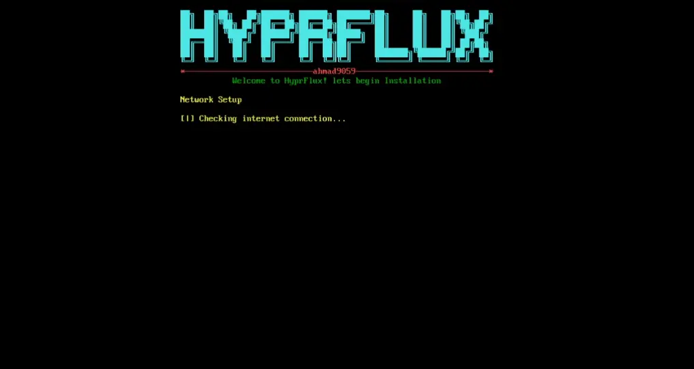
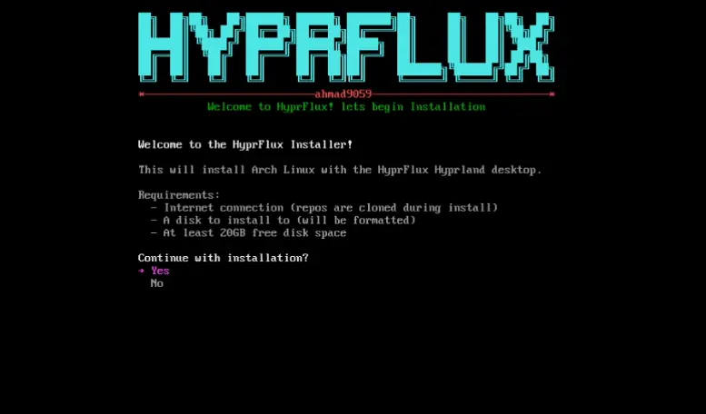
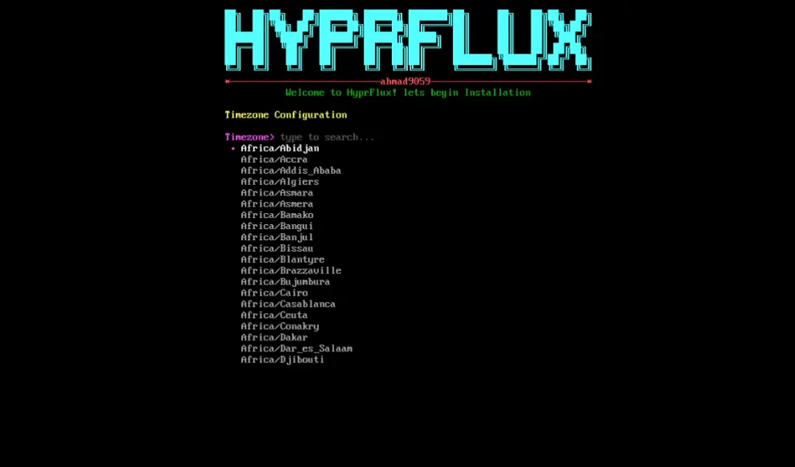
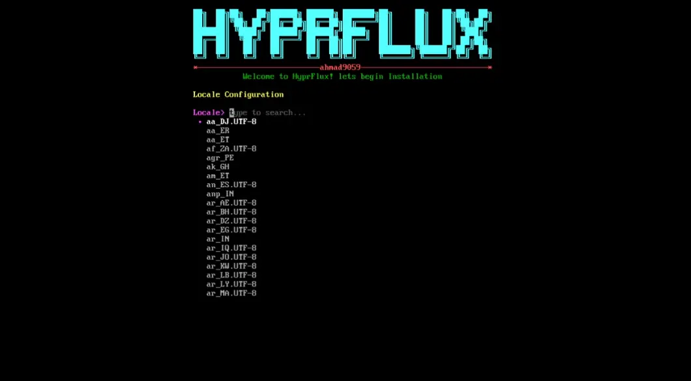
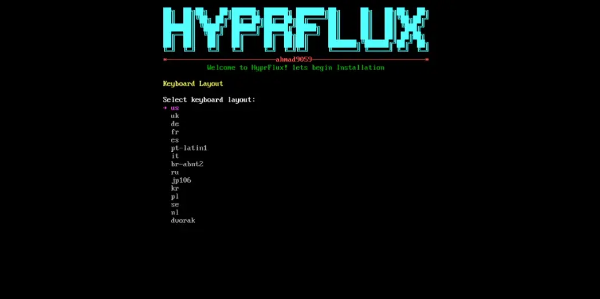
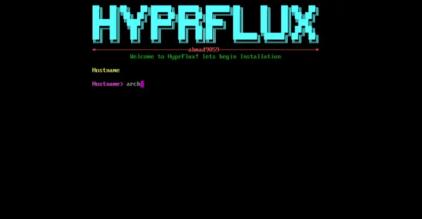
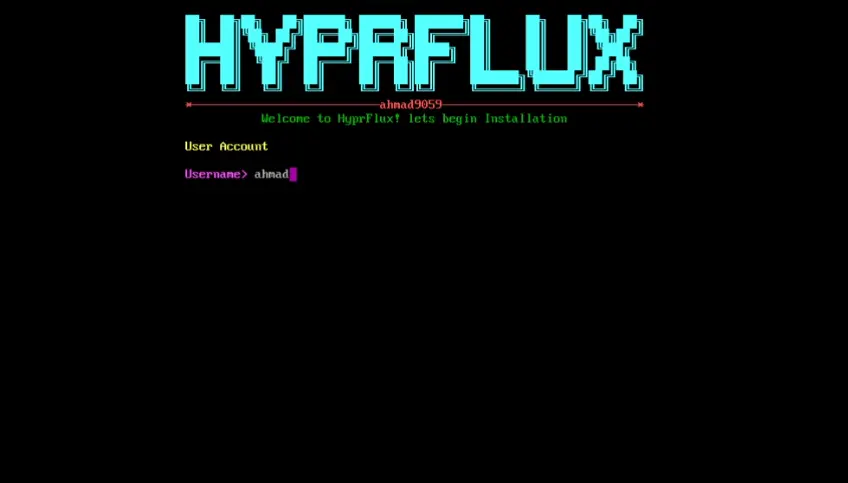
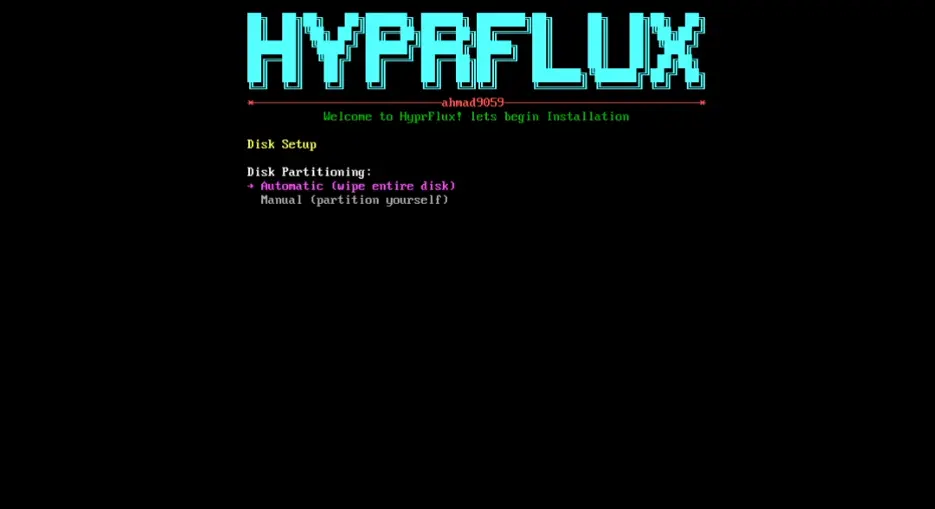

# ISO Installation Guide

The HyprFlux ISO installs an Arch Linux base and provisions the complete
HyprFlux desktop before the final reboot. It is an online installer and requires
network access throughout the installation.

## Requirements

- An x86_64 computer
- At least 4 GB of RAM; 8 GB or more is recommended
- At least 20 GB of target storage; the disk selector recommends about 25 GiB
  or more
- A USB drive large enough for the ISO
- An internet connection that permits the installer's connectivity check and
  package downloads

The source displays storage guidance but does not enforce a minimum. Leave
additional space for applications and personal files.

## Download and Verify

Download the latest `.iso` and matching `.sha256` file from the canonical
[HyprFlux release](https://github.com/ahmad9059/HyprFlux/releases/latest).
Alternative mirrors are listed on the [download page](/general/download).

Place both files in the same directory and verify them before writing the USB:

```bash
sha256sum -c hyprflux-*.iso.sha256
```

Continue only when the output reports `OK`. Do not verify an ISO with a
checksum obtained from another release channel.

## Create the Bootable USB

::: danger The selected USB device will be erased
`dd` writes to the entire destination device. Confirm the device with `lsblk`
and replace `/dev/sdX` with the USB device, not one of its partitions. Choosing
the wrong device destroys its data.
:::

```bash
lsblk
sudo dd bs=4M if=hyprflux-*.iso of=/dev/sdX status=progress oflag=sync
```

You can instead use [balenaEtcher](https://etcher.balena.io/) or another image
writer that performs a raw ISO write.

## Boot the ISO

1. Insert the USB and open your firmware boot menu.
2. Select the USB device.
3. Choose the normal HyprFlux installer. A copy-to-RAM option is also available.

The image supports UEFI through GRUB and legacy BIOS through Syslinux. Secure
Boot support is not currently documented by the installer source.




The live environment signs in as root on `tty1` and launches the text installer
automatically. If you exit it, you remain at a root shell.

## Installation Flow

### 1. Network check

The installer requires a successful ping to `1.1.1.1`. Ethernet normally uses
NetworkManager and DHCP. There is no Wi-Fi picker inside the installer; if the
check fails, it exits to the shell and tells you to run:

```bash
nmtui
```

After connecting, restart the installer:

```bash
bash ~/hyprflux-install.sh
```



### 2. Welcome and confirmation

Review the requirements and confirm that you intend to install Arch Linux and
HyprFlux. This confirmation does not erase a disk yet.



### 3. Regional settings

Select the timezone, regional locale, and console keyboard layout.

- Timezone detection may suggest a value based on your network.
- The locale selection controls regional date and time formatting; the
  installed system language remains `en_US.UTF-8`.
- Cancelling these selectors uses documented fallback values.







### 4. Hostname and user

Choose a hostname, then create a lowercase username and password. The installer
asks for a username, not a separate full name. Keep the password: it is used for
the normal account and the root account on the installed system.





### 5. Choose a disk method



**Automatic mode** creates a GPT/ext4 installation and erases the entire
selected disk. UEFI systems receive an EFI System Partition; BIOS systems
receive a BIOS Boot partition. Swap is optional.

Before erasing anything, the installer shows the selected device and requires
you to type the exact lowercase word `yes`. Destruction begins immediately
after that confirmation by clearing the partition table and filesystem
signatures.

::: danger Automatic mode destroys the selected disk
Back up all required data and verify the device model, path, and size. The
installer cannot undo the wipe.
:::

**Manual mode** opens an unrestricted root shell for you to partition, format,
and mount storage yourself. Mount root at `/mnt/archinstall`; on UEFI, mount the
EFI System Partition at `/mnt/archinstall/boot`.

Manual mode is an expert workflow. The installer checks only that the required
mountpoints are mounted. It does not validate filesystem types, partition
flags, available capacity, encryption, dual-boot safety, or that all mounts
belong to the intended device.

### 6. Install and configure Arch Linux

The installer selects mirrors, runs `pacstrap`, writes a UUID-based `fstab`,
and configures timezone, locale, keyboard, hostname, users, sudo, pacman,
NetworkManager, initramfs, and GRUB inside the target system. Package and mirror
operations may be retried automatically.

### 7. Provision HyprFlux in chroot

Before rebooting, the ISO fetches the HyprFlux revision pinned by that ISO
release and runs the desktop provisioning inside the target system. This stage
installs the base desktop and AUR packages, runs the numbered HyprFlux modules,
configures SDDM, Bluetooth and networking, and selects the graphical boot
target.

The installer then rebuilds and checks the initramfs and validates the root UUID
used by GRUB. A failed boot check prevents the automatic reboot.

### 8. Final reboot

On success, remove the USB or detach the ISO and press Enter. The installer
syncs data, unmounts the target, disables swap, verifies cleanup, and reboots.

Full HyprFlux provisioning happens before this reboot. Current releases do not
reboot into a TTY to ask for package groups or start a second desktop installer.

## First Desktop Login

Boot the installed system and sign in through SDDM with the account created
during installation. At the first desktop login, a narrowly scoped fixup:

- applies GTK, icon, cursor, font, and dark-mode settings;
- applies `nwg-look` settings;
- enables PipeWire and WirePlumber user services;
- retries any AUR packages recorded as missing.

If packages remain unavailable, that retry runs again on a later login. The
installer does not configure automatic login.

## Logs and Recovery Information

After installation, inspect retained HyprFlux-stage logs with:

```bash
less "$HOME/HyprFlux/logs/iso-wrapper.log"
less "$HOME/HyprFlux/logs/first-boot-aur.log"
ls -la "$HOME/HyprFlux/logs" "$HOME/HyprFlux/logs/installer"
```

The first-boot AUR log exists only after that fixup runs. Early partitioning,
formatting, and `pacstrap` progress logs are temporary and are not promised to
survive a failed live session.

If the installer exits before modifying storage, correct the reported problem
and restart it with `bash ~/hyprflux-install.sh`. After partitioning begins, do
not rerun or reformat blindly. Record the error and inspect the current mounts
and devices before taking further action.

For help, open a [HyprFlux issue](https://github.com/ahmad9059/HyprFlux/issues)
and include the ISO release, firmware mode, installation stage, device layout,
and any retained logs.
